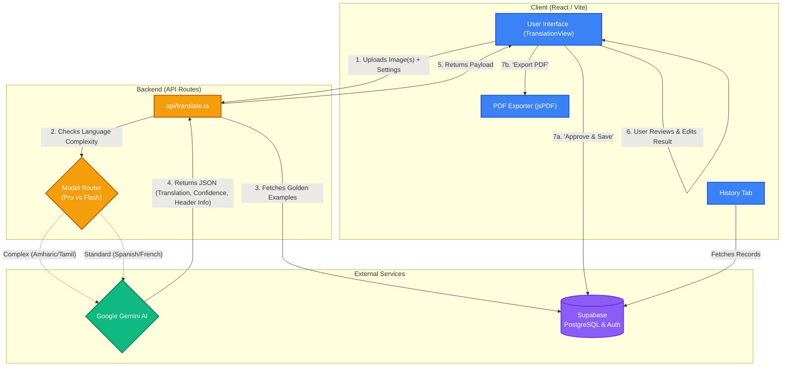

# Letter Translator Infrastructure & Flow Diagram

The following is a Mermaid diagram that outlines the architectural infrastructure and data flow for the Letter Translator application. You can copy and paste this into any Mermaid-compatible viewer (like GitHub, Notion, or the Mermaid Live Editor) to generate the diagram.

## Architectural Flow

### Flow Breakdown:
1. **Upload**: User uploads images and specifies target/source languages via the UI.
2. **Routing**: The `api/translate.ts` backend receives the request and dynamically routes it to either `gemini-3.1-pro-preview` (for complex languages) or `gemini-3-flash-preview` (for standard languages).
3. **Reference Fetching**: The API silently fetches "Golden References" from Supabase to provide formatting examples to the AI prompt.
4. **AI Processing**: Gemini processes the images using the combined static + dynamic instructions.
5. **Review**: The JSON payload (Data, Header, Confidence Score) returns to the UI for user review.
6. **Persistence**: Upon approval, the data (including parsed header info like Child Name and ID) is persisted to the Supabase Postgres database.
7. **Export**: The frontend securely compiles all data client-side into a formatted PDF using the local user's browser (no external PDF rendering service required).
