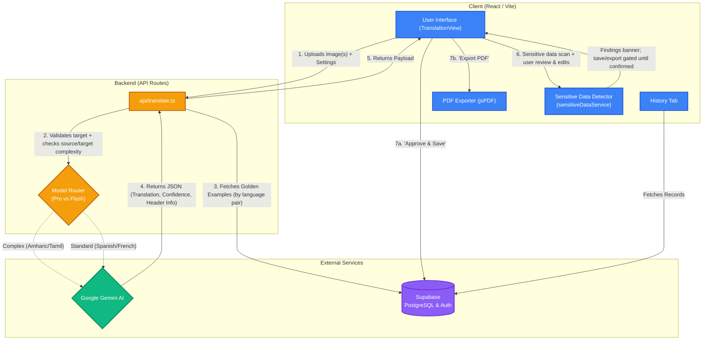

# Letter Translator Infrastructure & Flow Diagram

The following is a Mermaid diagram that outlines the architectural infrastructure and data flow for the Letter Translator application. You can copy and paste this into any Mermaid-compatible viewer (like GitHub, Notion, or the Mermaid Live Editor) to generate the diagram.

## Architectural Flow

```mermaid
graph TD
    %% Define Styles
    classDef frontend fill:#3b82f6,stroke:#1d4ed8,stroke-width:2px,color:#fff;
    classDef api fill:#f59e0b,stroke:#b45309,stroke-width:2px,color:#fff;
    classDef external fill:#10b981,stroke:#047857,stroke-width:2px,color:#fff;
    classDef db fill:#8b5cf6,stroke:#6d28d9,stroke-width:2px,color:#fff;

    %% Client Layer (Frontend)
    subgraph Client ["Client (React / Vite)"]
        UI["User Interface (TranslationView)"]:::frontend
        History["History Tab"]:::frontend
        PDFGen["PDF Exporter (jsPDF)"]:::frontend
        SensitiveCheck["Sensitive Data Detector<br/>(sensitiveDataService)"]:::frontend
    end

    %% Backend Layer (Serverless API)
    subgraph Serverless ["Backend (API Routes)"]
        TranslateAPI["api/translate.ts"]:::api
        ModelRouter{"Model Router<br/>(Pro vs Flash)"}:::api
    end

    %% External Services Layer
    subgraph ThirdParty ["External Services"]
        Gemini{"Google Gemini AI"}:::external
        Supabase[(Supabase<br/>PostgreSQL & Auth)]:::db
    end

    %% Flow Steps
    UI -- "1. Uploads Image(s) + Settings" --> TranslateAPI
    
    TranslateAPI -- "2. Validates target + checks source/target complexity" --> ModelRouter
    ModelRouter -. "Complex (Amharic/Tamil)" .-> Gemini
    ModelRouter -. "Standard (Spanish/French)" .-> Gemini
    
    TranslateAPI -- "3. Fetches Golden Examples (by language pair)" --> Supabase
    
    Gemini -- "4. Returns JSON (Translation, Confidence, Header Info)" --> TranslateAPI
    TranslateAPI -- "5. Returns Payload" --> UI
    
    UI -- "6. Sensitive data scan + user review & edits" --> SensitiveCheck
    SensitiveCheck -- "Findings banner; save/export gated until confirmed" --> UI
    
    UI -- "7a. 'Approve & Save'" --> Supabase
    History -- "Fetches Records" --> Supabase
    
    UI -- "7b. 'Export PDF'" --> PDFGen
```

### Flow Breakdown:
1. **Upload**: User uploads images and selects the source language (or Auto-Detect) and the target language via the UI. Same-language pairs are blocked.
2. **Routing**: The `api/translate.ts` backend verifies the user's session, checks the target against an allow-list, and routes to `gemini-3.1-pro-preview` when the source or target is a complex script, or `gemini-3.5-flash` otherwise. If the primary model is unavailable it falls back to `gemini-3.5-flash` or `gemini-3.1-flash-lite`.
3. **Reference Fetching**: The API silently fetches "Golden References" from Supabase to provide examples to the AI prompt. For non-English targets it only uses references that match both the source and target language.
4. **AI Processing**: Gemini processes the images using the combined static + dynamic instructions and writes the translation in the target language.
5. **Review**: The JSON payload (Data, Header, Confidence Score) returns to the UI for user review.
6. **Sensitive Data Check**: The browser scans the transcription and translation for emails, phone numbers, links and social media. Findings appear in a red banner, and saving/exporting is disabled until staff confirm they reviewed them. The check re-runs as the text is edited.
7. **Persistence**: Upon approval, the data (including parsed header info like Child Name and ID, and the source/target language) is persisted to the Supabase Postgres database.
8. **Export**: The frontend compiles all data client-side into a formatted PDF in the user's browser (no external PDF rendering service). The translation uses the font for the target language's script.
