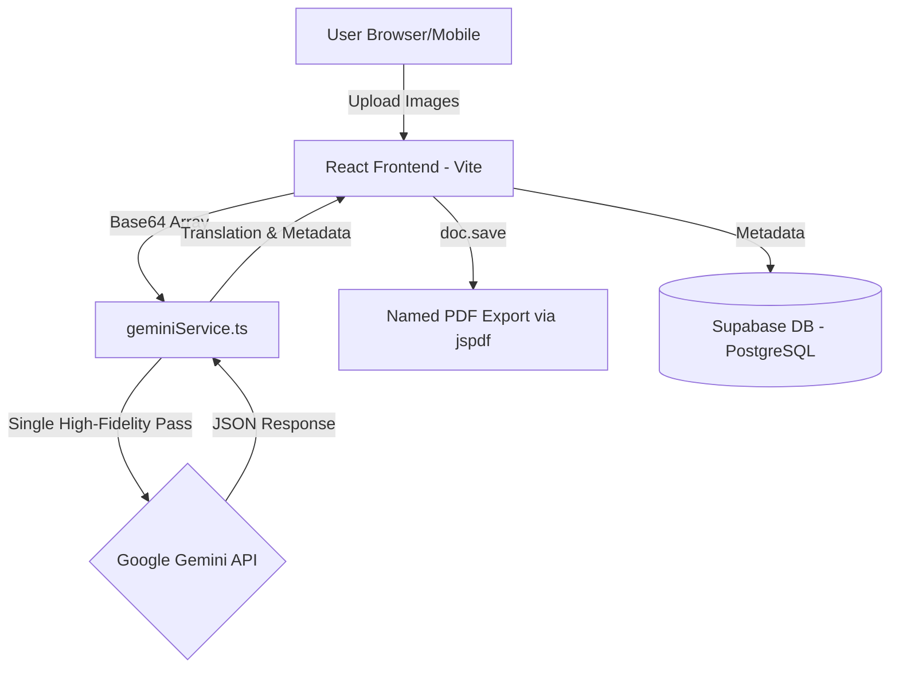

# Deployment Plan & Cost Analysis: Letter Translator Gemini

## 1. Project Requirements & Usage Assumptions

**User Base:**
- **Users**: ~20 active users (distributed across Africa, India, Central America).
- **Activity**: ~65 letter uploads/day (Total = ~2,000 uploads/month).
- **Platform**: Web-based (Mobile & Desktop).

**Technical Needs:**
- **Frontend**: React (Vite) Single Page Application.
- **Backend/Auth**: Supabase (PostgreSQL, Auth, Storage).
- **AI Processing**: Google Gemini 2.0 Flash for multimodal image interpretation and synthesis.

---

## 2. System Architecture

### **A. Technical Stack**
- **AI Engine**: Google Generative AI SDK (`@google/generative-ai`).
- **Model**: `gemini-2.0-flash` (Paid Tier 1).
- **PDF Export**: `jspdf` using Legacy Save method to ensure filename integrity and branding consistency.

### **B. Architecture Diagram**

### **System Flow & Procedures:**
1.  **Client (React/Vite)**: User uploads images via the browser interface.
2.  **geminiService.ts**: Synthesizes multiple images into a **Single High-Fidelity Pass request**. This batching minimizes token overhead and keeps the operation within the API's rate limits (10 RPM).
3.  **Google AI API**: The `gemini-2.0-flash` model processes the batch in one context window and returns a structured JSON containing the Transcription and Translation.
4.  **Export**: The client generates a sanitized, branded PDF report using `jspdf`.
5.  **Storage**: Metadata (Child ID, Date, Name) and valid translations are securely stored in **Supabase (PostgreSQL)** for history tracking.

---

## 3. Cost Analysis Breakdown

### **A. Google Gemini 2.0 Flash Costs (Estimated)**
*Note: Pricing based on Google Gemini Paid Tier.*

**Pricing Model:**
- **Input (Text/Prompts)**: ~$0.10 per 1 million tokens.
- **Output (Translation)**: ~$0.40 per 1 million tokens.
- **Images**: Fixed cost of **258 tokens** per image.

**Per Letter Calculation (Avg 2 Pages):**
| Component | Token Count | Cost Calculation | Estimated Cost |
| :--- | :--- | :--- | :--- |
| **Images (Input)** | 2 images * 258 | 516 tokens * ($0.10/1M) | ~$0.00005 |
| **System Prompt** | ~500 tokens | 500 tokens * ($0.10/1M) | ~$0.00005 |
| **Output Text** | ~700 tokens | 700 tokens * ($0.40/1M) | ~$0.00028 |
| **TOTAL** | **~1,716 Tokens** | | **~$0.00038 / letter** |

**Monthly Projection (2,000 Letters):**
- **Total AI Cost**: 2,000 * $0.00038 = **~$0.76 USD / month**.

### **B. Hosting & Storage**
| Component | Provider | Plan | Cost |
| :--- | :--- | :--- | :--- |
| **Frontend** | Vercel | Pro Plan | **$20.00** |
| **Database** | Supabase | Pro Plan | **$25.00** |
| **AI Compute** | Google Gemini | Pay-as-you-go | **<$1.00** |
| **TOTAL** | | | **~$46.00 / month** |

*\*Note: At 2,000 letters/month (~10GB/mo of images), the Supabase Pro Plan is REQUIRED as it exceeds the Free Tier's 1GB limit.*

---

## 4. AI Processing Logic: "The Literal Scribe"

To ensure high accuracy and cultural fidelity, the system employs specific strategies:

1.  **Single High-Fidelity Pass**:
    - Instead of processing pages individually, all images are sent in one request. This allows the model to understand the narrative flow across pages (e.g., a sentence starting on page 1 and finishing on page 2).

2.  **Cultural Anchors & Personas**:
    - **Telugu**: Specific instructions to hunt for "Sankranti holidays", seasonal crops, and family-specific greetings.
    - **Spanish**: Identifies "Padrino/Madrina" relationships specific to Latin American dialects.
    - **First-Person Enforcement**: The AI is strictly instructed to write as the **child**, using "I/We/My", preventing third-person summarization.

3.  **Stability & Rate Limit Management**:
    - **RPM Management**: Respects the hard limit of 10 Requests Per Minute for the Flash model.
    - **Exponential Backoff**: `geminiService.ts` includes automatic retry logic (2s -> 4s -> 8s) to gracefully handle `429 Too Many Requests` errors without failing the user task.

---

## 5. Security, Privacy & Data Residency

Given the sensitivity of collecting data from children, this architecture prioritizes **security, privacy, and compliance** at every layer.

### **A. Data Residency (Canada/Global)**
*   **Database & Storage (Supabase)**:
    *   **Recommendation**: Select the **Canada (Central)** region (`ca-central-1`) when creating your Supabase project.
    *   **Benefit**: Ensures all beneficiary data (names, IDs, letters) remains hosted on servers physically located in Canada, aligning with Canadian data sovereignty preferences for a `.ca` organization.
    *   *Alternative*: US East (N. Virginia) is also available if preferred, but Canada is recommended for compliance.

### **B. Database Security Measures**
*   **Row-Level Security (RLS)**:
    *   **Implemented**: We strictly enforce RLS policies.
    *   **Mechanism**: A user **CANNOT** query or view another user's uploads. The database rejects unauthorized requests at the engine level.
    *   **Authentication**: Integrated with Supabase Auth (JWT tokens) ensuring only valid, logged-in personnel can access the API.
*   **Encryption**:
    *   **At Rest**: All data allowed in the database and storage buckets is encrypted on disk (AES-256).
    *   **In Transit**: All traffic between the App, Supabase, and Gemini is encrypted via TLS/SSL (HTTPS).

### **C. AI Privacy (Google Gemini Paid Tier)**
*   **Zero Data Training**:
    *   **Policy**: Google Cloud's [terms for Generative AI](https://cloud.google.com/vertex-ai/docs/generative-ai/data-governance) on paid tiers guarantee that **customer data is NOT used to train foundation models**.
    *   **Privacy**: The letters sent to the AI for translation are processed in memory and discarded (stateless). They do not become part of the public knowledge base.
*   **Content Filtering**:
    *   **Safety**: Google Gemini includes built-in safety settings (blocked/filtered content) which we have configured to safeguard against harmful output while ensuring no valid cultural text is flagged incorrectly.

### **D. Recommended Additional Measures**
*   **Data Retention Policy**:
    *   Configure Supabase Storage objects to **auto-expire** after 30-90 days if long-term history is not legally required.
*   **Audit Logs**:
    *   Enable Supabase Access Logs to track who accessed which records and when (available on Pro Plan).

---

## 6. Deployment Steps

1.  **Frontend (Vercel)**
    -   **Connect Repo**: Link the `nestico/letter-translator-gemini` GitHub repository.
    -   **Environment Variables**: Add the production keys:
        -   `VITE_GEMINI_API_KEY`
        -   `VITE_SUPABASE_URL`
        -   `VITE_SUPABASE_ANON_KEY`
    -   **Why Vercel?**: Leverage the Edge Network for performant delivery to users in Africa and India.

2.  **Backend (Supabase)**
    -   **Action**: Upgrade to **Pro Plan ($25/mo)** immediately to handle Image Storage (>1GB/mo).
    -   **Data Residency**: Verify project region is **Canada (Central)**.
    -   **Lifecycle (Optional)**: Configure storage buckets to auto-delete images after 90 days if strict retention policies apply.

3.  **AI (Google Gemini)**
    -   **Billing**: Ensure a payment method is attached to the Google Cloud Project to enable the **Paid Tier** (removing rate limits and data training).
    -   **Budget**: Set a monthly budget cap of **$20.00** to prevent any unexpected runaway costs.

## 6. Corporate Production Deployment
**Target URL**: `https://letter-app.childrenbelieve.ca`

### 6.1 Domain Configuration (DNS)
To map the application to the corporate domain, the following DNS record must be created by the IT Department:

| Record Type | Host/Name | Target | TTL |
| :--- | :--- | :--- | :--- |
| **CNAME** | `letter-app` | `cname.vercel-dns.com` | 3600 (1 hour) |

### 6.2 Scaling & High Concurrency (10+ Users)
To maintain stability during concurrent sessions:
*   **Queue Management**: Utilizing `p-queue` to limit API throughput to 10 RPM (matching Paid Tier 1 limits).
*   **Sequential Processing**: 3-page sequential image synthesis is prioritized to maintain narrative consistency.
*   **Serverless Timeout**: Function max duration is set to 60s in `vercel.json` to allow for deep multimodal analysis of long letters.

### 6.3 SSL & Security
*   **SSL/TLS**: Automated certificates via Let's Encrypt, managed by Vercel.
*   **Data Residency**: Strict adherence to `ca-central-1` (Canada) for all database and file storage operations.
*   **User Restriction**: Access is restricted via Supabase Auth. IT can manually manage the user whitelist in the Supabase Dashboard to ensure only authorized personnel can sign in.

---

## 7. Deployment Presentation Prompts (Google NotebookLM)

Use these prompts in Google NotebookLM (or ChatGPT/Gemini) to generate a professional presentation for your management team.

### **Prompt 1: Executive Summary & Architecture**
> "Act as a Senior Cloud Architect. Create a slide presentation targeting IT Managers and Executives for the 'Letter Translator' project deployment.
> 
> **Context**: We are deploying a web app for 20 global users (Africa, India, Central America) to translate 2,000 handwritten letters per month using Google Gemini AI.
> **Architecture**:
> 1. Frontend: React hosted on Vercel's Global Edge Network (ensuring low latency for global users).
> 2. Backend: Supabase (PostgreSQL) for secure Auth and Database.
> 3. AI: Google Gemini 2.0 Flash via secure API proxy for translation.
> 
> **Goal**: Explain why we chose this Serverless/CDN architecture over a traditional VPS. Highlight benefits: Global speed, Zero maintenance, and Security."

### **Prompt 2: Cost Analysis & ROI (Scale: 2,000 Letters/Mo)**
> "Create a financial breakdown slide for the 'Letter Translator' project.
> **Usage Scenario**: 20 users, 2,000 total letter uploads/month.
> 
> **Compare two options**:
> 1. **Recommended (Usage-Based)**: Vercel Pro ($20) + Supabase Pro ($25) + Gemini AI (<$1). Total: ~$46/month.
> 2. **Traditional (VPS)**: Hostinger High-Spec VPS ($20) + Supabase Pro ($25) + DevOps Maintenance Time (estimated 10 hours/mo for patching/security at $50/hr). Total: ~$545/month.
> 
> **Conclusion**: Emphasize that the Recommended Serverless option is ~12x cheaper when factoring in maintenance time and offer 99.9% uptime SLA."

### **Prompt 3: Security & Data Sovereignty**
> "Draft a slide addressing Data Privacy and Security compliance for Canadian Data.
> Key Points:
> - **Authentication**: Managed by Supabase (SOC2 compliant).
> - **Data Residency**: All database and image storage is hosted in Canada (Central) region.
> - **AI Privacy**: We use Google Gemini Paid Tier, which guarantees **customer data is NOT used to train foundation models**.
> - **Access Control**: Role-Based User Access (users only see their own translations)."

---

## 8. Session Log: Technical Overhaul (Jan 20, 2026)

### **A. Branding & UI Updates**
1.  **Rebranding**: Scaled the UI to match "Children Believe" identity.
    *   **Navbar**: Implemented a white, sticky navbar (`z-50`) with the official logo (`h-12`).
    *   **Colors**: Updated primary actions to use brand purple (`#522d6d`) and simplified the color palette.
    *   **Hero**: Cleaned up the landing area, removing redundant logos and reverting to a stable dark/light theme structure.
2.  **Language Selection Control**:
    *   **Source Language**: Restored the dropdown to allow explicit user selection (e.g., Telugu, Spanish), improving AI accuracy.
    *   **Target Language**: Locked to "English" (Disabled/Read-Only) to prevent misconfiguration.

### **B. Gemini Service Optimization (High Concurrency)**
1.  **Repetition Loop Fix**:
    *   **Problem**: The model was entering infinite character loops (e.g., "s's's's") during PDF export.
    *   **Solution**:
        *   **Maximal Penalties**: Increased `frequencyPenalty` to **1.5** and `presencePenalty` to **1.0**.
        *   **Stop Sequences**: Configured `stopSequences: ["END_OF_TRANSLATION"]` as a hard circuit breaker.
        *   **Binary Stop Rule**: Updated prompt to strictly command: *"Output EXACTLY ONCE... STOP IMMEDIATELY after signature"*.
2.  **Concurrency Management**:
    *   **Jittered Backoff**: Enhanced `generateWithRetry` to include random jitter (0-1000ms). This prevents "thundering herd" issues where multiple users hitting a rate limit retry at the exact same millisecond.
    *   **Payload Protection**: Added a client-side check to warn if image payloads exceed **20MB** (preventing `413` errors).
3.  **Accuracy Logic**:
    *   **System Judge**: Added a self-correction step in the prompt: *"Verify: Did I output the translation exactly once? Did I stop at the signature?"*.
    *   **Metadata Isolation**: Enforced strict separation of Child ID/Name into a separate JSON object to prevent leakage into the translation body.

### **C. Queue & Multi-Page Fidelity (Update Jan 20 PM)**
1.  **Request Queuing (Rate Protection)**:
    *   **Architecture**: Implemented `p-queue` to manage API ingress.
    *   **Traffic Shaping**: Limit **1 request** at a time per client (Sequential) with a global rate cap of **10 req/min**.
    *   **User Feedback**: Added UI indicators for "Queue Position #X" and "Estimated Wait Time" to manage expectations.
2.  **Anti-Laziness Strategy (Tamil/Spanish)**:
    *   **Problem**: Gemini sometimes stopped after Page 1 or produced "lazy" summaries.
    *   **Configuration**: Raised `temperature` to **1.0** to force context exploration.
    *   **Prompting**: Added "Global Scan" instructions to read *all* images before writing, and "Sequential Stitching" logic to bridge sentences across pages.

