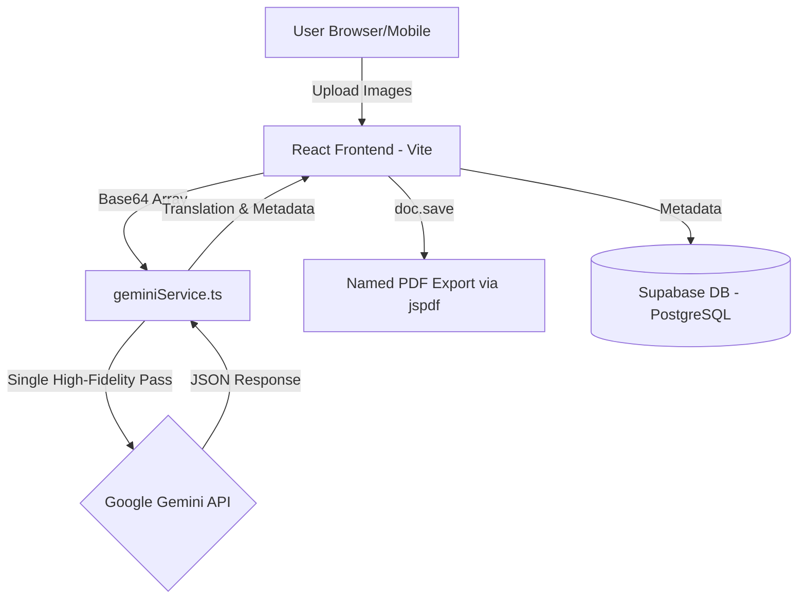

# Deployment Plan & Cost Analysis: Letter Translator Gemini

## 1. Project Requirements & Usage Assumptions

**User Base:**
- **Users**: ~20 active users (distributed across Africa, India, Central America).
- **Activity**: ~10 letter uploads/day (Total = ~300 uploads/month).
- **Platform**: Web-based (Mobile & Desktop).

**Technical Needs:**
- **Frontend**: React (Vite) Single Page Application.
- **Backend/Auth**: Supabase (PostgreSQL, Auth, Storage).
- **AI Processing**: Google Gemini 2.0 Flash for multimodal image interpretation and synthesis.

---

## 2. System Architecture

### **A. Technical Stack**
- **AI Engine**: Google Generative AI SDK (`@google/generative-ai`).
- **Model**: `gemini-2.0-flash` (Paid Tier 1).
- **PDF Export**: `jspdf` using Legacy Save method to ensure filename integrity and branding consistency.

### **B. Architecture Diagram**

### **System Flow & Procedures:**
1.  **Client (React/Vite)**: User uploads images via the browser interface.
2.  **geminiService.ts**: Synthesizes multiple images into a **Single High-Fidelity Pass request**. This batching minimizes token overhead and keeps the operation within the API's rate limits (10 RPM).
3.  **Google AI API**: The `gemini-2.0-flash` model processes the batch in one context window and returns a structured JSON containing the Transcription and Translation.
4.  **Export**: The client generates a sanitized, branded PDF report using `jspdf`.
5.  **Storage**: Metadata (Child ID, Date, Name) and valid translations are securely stored in **Supabase (PostgreSQL)** for history tracking.

---

## 3. Cost Analysis Breakdown

### **A. Google Gemini 2.0 Flash Costs (Estimated)**
*Note: Pricing based on Google Gemini Paid Tier.*

**Pricing Model:**
- **Input (Text/Prompts)**: ~$0.10 per 1 million tokens.
- **Output (Translation)**: ~$0.40 per 1 million tokens.
- **Images**: Fixed cost of **258 tokens** per image.

**Per Letter Calculation (Avg 2 Pages):**
| Component | Token Count | Cost Calculation | Estimated Cost |
| :--- | :--- | :--- | :--- |
| **Images (Input)** | 2 images * 258 | 516 tokens * ($0.10/1M) | ~$0.00005 |
| **System Prompt** | ~500 tokens | 500 tokens * ($0.10/1M) | ~$0.00005 |
| **Output Text** | ~700 tokens | 700 tokens * ($0.40/1M) | ~$0.00028 |
| **TOTAL** | **~1,716 Tokens** | | **~$0.00038 / letter** |

**Monthly Projection (300 Letters):**
- **Total AI Cost**: 300 * $0.00038 = **~$0.11 USD / month**.

### **B. Hosting & Storage**
| Component | Provider | Plan | Cost |
| :--- | :--- | :--- | :--- |
| **Frontend** | Vercel or Netlify | Free Tier | **$0.00** |
| **Database** | Supabase | Free Tier* | **$0.00** |
| **AI Compute** | Google Gemini | Pay-as-you-go | **<$1.00** |
| **TOTAL** | | | **<$1.00 / month** |

*\*Note: Supabase Free Tier includes 500MB database and 1GB file storage. If image storage needs exceed 1GB, a Pro plan ($25/mo) will be required.*

---

## 4. AI Processing Logic: "The Literal Scribe"

To ensure high accuracy and cultural fidelity, the system employs specific strategies:

1.  **Single High-Fidelity Pass**:
    - Instead of processing pages individually, all images are sent in one request. This allows the model to understand the narrative flow across pages (e.g., a sentence starting on page 1 and finishing on page 2).

2.  **Cultural Anchors & Personas**:
    - **Telugu**: Specific instructions to hunt for "Sankranti holidays", seasonal crops, and family-specific greetings.
    - **Spanish**: Identifies "Padrino/Madrina" relationships specific to Latin American dialects.
    - **First-Person Enforcement**: The AI is strictly instructed to write as the **child**, using "I/We/My", preventing third-person summarization.

3.  **Stability & Rate Limit Management**:
    - **RPM Management**: Respects the hard limit of 10 Requests Per Minute for the Flash model.
    - **Exponential Backoff**: `geminiService.ts` includes automatic retry logic (2s -> 4s -> 8s) to gracefully handle `429 Too Many Requests` errors without failing the user task.

---

## 5. Security & Privacy

1.  **Data Residency**: Supabase project configured for **Canada (Central)** where possible to align with data sovereignty.
2.  **AI Privacy**: Data sent to the Google Gemini API (Paid Tier) is **not** used to train Google's public models.
3.  **Authentication**: Valid Supabase Auth session required for all translation operations.
