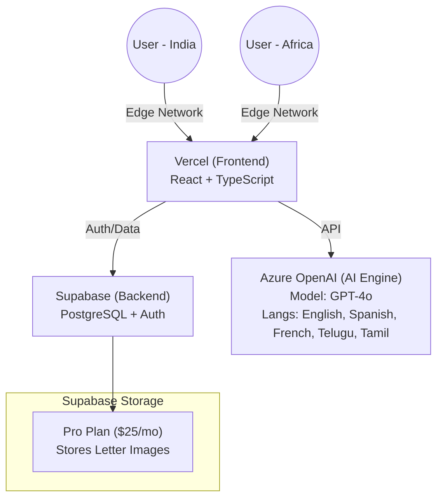

# Deployment Plan & Cost Analysis: Letter Translator App

## 1. Project Requirements & Usage Assumptions

**User Base:**
- **Users**: ~20 active users (distributed across Africa, India, Central America).
- **Activity**: ~10 letter uploads/day (Total = ~300 uploads/month).
- **Platform**: Web-based (Mobile & Desktop).

**Technical Needs:**
- **Frontend**: React (Vite) Single Page Application.
- **Backend/Auth**: Supabase (PostgreSQL, Auth, Storage).
- **AI Processing**: Azure OpenAI (GPT-4o) for image interpretation.

---

## 2. Cost Analysis Breakdown

### **A. Usage & Hosting Costs**

#### **1. Frontend Hosting** (Vercel vs. Netlify vs. Hostinger vs. Azure)

| Provider | Plan | Monthly Cost | Pros | Cons |
| :--- | :--- | :--- | :--- | :--- |
| **Vercel** | **Free Tier** | **$0** | Fastest for React; Global CDN (great for speed in India/Africa); Zero-config; "Set and forget". | Commercial use technically restricted (though strictly enforced mainly for growing businesses). |
| **Netlify** | **Free Tier** | **$0** | Excellent global CDN; 100GB bandwidth/mo (plenty for 300 images). | Similar commercial restrictions to Vercel on free tier. |
| **Azure Static Apps** | **Free Tier** | **$0** | Deep integration if you put everything in Azure later. | Slightly slower deployment cold starts than Vercel. |
| **Hostinger** | **Business Shared** | **~$3.99 - $8.99** | Complete control; Email included; No "commercial use" restrictions. | **Overkill & Slower**. React apps are static files; hosting them on a traditional PHP/Node server is unnecessary and slower than a global CDN. |
| **Hostinger** | **VPS KVM 1** | **~$4.99 - $7.99** | Full root access; isolated resources. | Requires manual server maintenance, security patches, Nginx config. High effort. |

**Recommendation:**
**Stick with Vercel (Free)** or **Netlify (Free)**.
*   **Why?** Static hosting CDNs (Vercel/Netlify) serve your app from servers *closest* to your users in India/Africa/Central America automatically. Hostinger Shared/VPS typically serves from **one** location (e.g., USA or Amsterdam), making the app slower for global users.
*   **Bandwidth Check:** 300 uploads/month * ~5MB/image = 1.5GB/month. Vercel/Netlify give you **100GB** for free. You are utilizing <2% of the free limit.

---

#### **2. Database & Storage (Supabase)**

| Resource | Usage (Est.) | Free Tier Limit | Cost |
| :--- | :--- | :--- | :--- |
| **Database** | Metadata for 300 letters | 500 MB | **$0** |
| **File Storage** | 300 images * 5MB = 1.5GB/mo | 1 GB | **Risk ($0)** |
| **Auth** | 20 Users | 50,000 MAU | **$0** |

**Cost Warning:**
The Supabase **Free Tier** includes only **1GB** of file storage.
- Month 1: 1.5GB usage -> **Exceeds free limit**.
- **Solution**:
    1.  **Upgrade to Pro ($25/mo)**: Get 100GB storage.
    2.  **External Storage**: Store images in Azure Blob Storage or AWS S3 instead (~$0.02/GB) if you want to save money, but this adds coding complexity.

---

#### **3. AI Processing (Azure OpenAI GPT-4o)**
*Note: This is "Pay-as-you-go". You only pay for what you process.*

**Input Cost (Images):**
- **Low Detail**: ~$0.003 / image.
- **High Detail**: ~$0.012 / image.
- **Assumed Mix**: Mostly High Detail (handwriting requires clarity).

**Output Cost (Translation Text):**
- ~500 tokens (approx 400 words) per letter.
- Cost: $15.00 / 1M output tokens = $0.0075 per letter.

**Monthly Projection:**
- **Images**: 300 letters * $0.012 = **$3.60**
- **Text**: 300 letters * $0.0075 = **$2.25**
- **Total AI Cost**: **~$5.85 / month**

---

## 3. Total Monthly Cost Comparison

| Component | **Option A: "Start Free"** (Vercel + Supabase Free) | **Option B: "Production Ready"** (Vercel + Supabase Pro) | **Option C: "Hostinger"** (Hostinger + Supabase Pro) |
| :--- | :--- | :--- | :--- |
| **Frontend** | $0 (Vercel Free) | $0 (Vercel Free) | ~$4.99 (Hostinger VPS) |
| **Backend/DB** | $0 (Supabase Free)* | $25 (Supabase Pro) | $25 (Supabase Pro) |
| **AI Usage** | ~$5.85 (Azure) | ~$5.85 (Azure) | ~$5.85 (Azure) |
| **TOTAL** | **~$5.85 / mo** | **~$30.85 / mo** | **~$35.84 / mo** |

* *Option A risks hitting the 1GB storage limit in the first month. We recommend Option B for stability.*

---

## 4. Architecture & Procedures

### **Architecture**

### **Deployment Steps**

1.  **Frontend (Vercel)**
    - Connect GitHub Repo `nestico/child-letter`.
    - Add Env Vars from `.env`.
    - **Why Vercel?** Better performance for 20 users spread across 3 continents due to Edge Network.

2.  **Backend (Supabase)**
    - **Action**: Upgrade to **Pro Plan ($25/mo)** immediately to handle Image Storage (100GB included).
    - Or, configure **Lifecycle Policies** to auto-delete images after 30 days to stay on Free Tier (if history is not critical).

3.  **AI (Azure)**
    - Configure the `gpt-4o` deployment.
    - Set a **Spending Limit** of $20/mo on the Azure subscription to prevent runaway costs.

### **Why NOT Hostinger?**
For a React app with a global user base (Africa, India, Central America):
1.  **Latency**: Hostinger Shared/VPS serves from a single physical location. A user in India accessing a server in the US will face lag. Vercel replicates your site to servers in Mumbai, Cape Town, and Sao Paulo instantly.
2.  **Complexity**: Hostinger requires managing Node.js versions, Nginx configuration, and SSL certificates manually (on VPS). Vercel handles this automatically.
3.  **Cost**: You pay ~$5-10/mo for Hostinger just to host static files, which Vercel does for free (or $20/mo for Pro with better SLAs).

---

## 5. Deployment Presentation Prompts (Google NotebookLM)

Use these prompts in Google NotebookLM (or ChatGPT/Gemini) to generate a professional presentation for your management team.

### **Prompt 1: Executive Summary & Architecture**
> "Act as a Senior Cloud Architect. Create a slide presentation targeting IT Managers and Executives for the 'Letter Translator' project deployment.
> 
> **Context**: We are deploying a web app for 20 global users (Africa, India, Central America) to translate handwritten letters using Azure OpenAI.
> **Architecture**:
> 1. Frontend: React hosted on Vercel's Global Edge Network (ensuring low latency for global users).
> 2. Backend: Supabase (PostgreSQL) for secure Auth and Database.
> 3. AI: Azure OpenAI (GPT-4o) via secure API proxy for translation.
> 
> **Goal**: Explain why we chose this Serverless/CDN architecture over a traditional VPS (like Hostinger). Highlight benefits: Global speed, Zero maintenance, and Security."

### **Prompt 2: Cost Analysis & ROI**
> "Create a financial breakdown slide for the 'Letter Translator' project.
> **Usage Scenario**: 20 users, 300 total letter uploads/month.
> 
> **Compare two options**:
> 1. **Recommended (Usage-Based)**: Vercel (Free) + Supabase Pro ($25) + Azure AI (~$6). Total: ~$31/month.
> 2. **Traditional (VPS)**: Hostinger VPS ($8) + Supabase Pro ($25) + Azure AI (~$6) + DevOps Maintenance Time (estimated 5 hours/mo at $50/hr). Total: ~$39 + $250 labor = ~$289/month.
> 
> **Conclusion**: Emphasize that the Recommended Serverless option is 9x cheaper when factoring in maintenance time and offers 99.9% uptime SLA."

### **Prompt 3: Security & Privacy**
> "Draft a slide addressing Data Privacy and Security compliance.
> Key Points:
> - **Authentication**: Managed by Supabase (SOC2 compliant).
> - **Data Storage**: Images stored in secure, private buckets (RLS policies enforced).
> - **AI Privacy**: We use Azure OpenAI Service, which guarantees that **our data is NOT used to train OpenAI's public models**. This ensures beneficiary privacy.
> - **Access Control**: Role-Based User Access (users only see their own translations)."

---

## 6. Security, Privacy & Data Residency

Given the sensitivity of collecting data from children, this architecture prioritizes **security, privacy, and compliance** at every layer.

### **A. Data Residency (Canada/Global)**
*   **Database & Storage (Supabase)**:
    *   **Recommendation**: Select the **Canada (Central)** region (`ca-central-1`) when creating your Supabase project.
    *   **Benefit**: Ensures all beneficiary data (names, IDs, letters) remains hosted on servers physically located in Canada, aligning with Canadian data sovereignty preferences for a `.ca` organization.
    *   *Alternative*: US East (N. Virginia) is also available if preferred, but Canada is recommended for compliance.

### **B. Database Security Measures**
*   **Row-Level Security (RLS)**:
    *   **Implemented**: We strictly enforce RLS policies.
    *   **Mechanism**: A user **CANNOT** query or view another user's uploads. The database rejects unauthorized requests at the engine level.
    *   **Authentication**: Integrated with Supabase Auth (JWT tokens) ensuring only valid, logged-in personnel can access the API.
*   **Encryption**:
    *   **At Rest**: All data allowed in the database and storage buckets is encrypted on disk (AES-256).
    *   **In Transit**: All traffic between the App, Supabase, and Azure is encrypted via TLS/SSL (HTTPS).

### **C. AI Privacy (Azure OpenAI)**
*   **Zero Data Training**:
    *   **Policy**: Microsoft's Azure OpenAI Service strictly guarantees that **customer data is NOT used to train or improve their foundation models** (unlike the consumer ChatGPT).
    *   **Privacy**: The letters sent to the AI for translation are processed in memory and discarded (stateless). They do not become part of the public knowledge base.
*   **Content Filtering**:
    *   **Safety**: Azure includes built-in content filtering to detect and block hate speech, violence, or sexual content, ensuring safe operation.

### **D. Recommended Additional Measures**
*   **Data Retention Policy**:
    *   Configure Supabase Storage objects to **auto-expire** after 30-90 days if long-term history is not legally required.
*   **Audit Logs**:
    *   Enable Supabase Access Logs to track who accessed which records and when (available on Pro Plan).

---

## 7. Custom Domain Configuration

You requested using the subdomain: **`letter-app.childrenbelieve.ca`**.
**Yes, this is fully supported and recommended.**

### **Integration Procedure (For IT Team)**

1.  **Vercel Configuration**:
    - In your Vercel Project Dashboard, go to **Settings > Domains**.
    - Add `letter-app.childrenbelieve.ca`.
    - Vercel will provide a **Value** specifically for your project (e.g., `cname.vercel-dns.com`).

2.  **DNS Update (at childrenbelieve.ca provider)**:
    - Your IT team needs to access the DNS settings for `childrenbelieve.ca`.
    - **Add a CNAME Record**:
        - **Type**: `CNAME`
        - **Name/Host**: `letter-app` (this creates the subdomain part)
        - **Value/Target**: `cname.vercel-dns.com` (Use the exact value Vercel gives you).

3.  **Result**:
    - Users can visit `https://letter-app.childrenbelieve.ca`.
    - Vercel automatically issues and renews a **Free SSL Certificate** (HTTPS) for this subdomain.
    - No manual server configuration is required.
